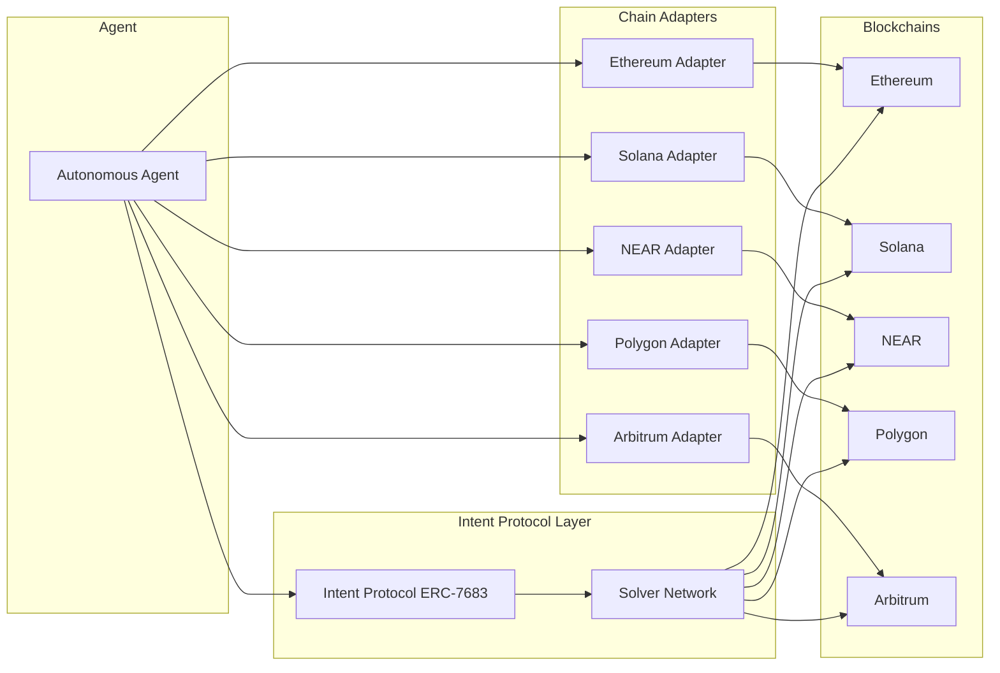
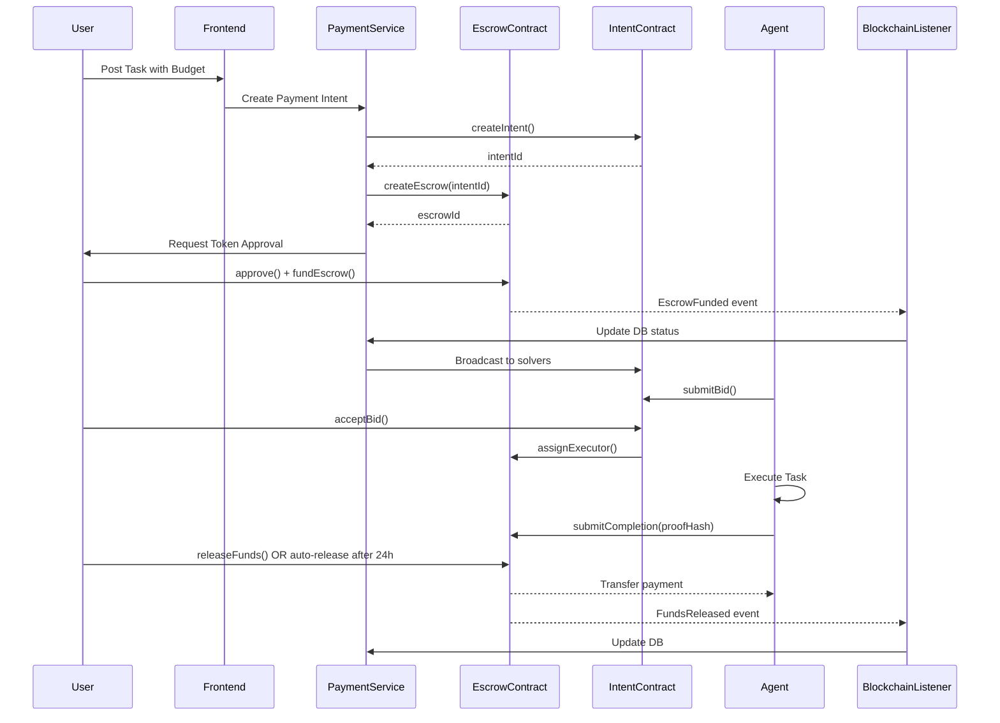
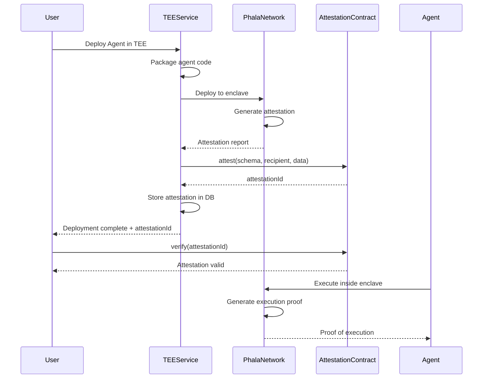
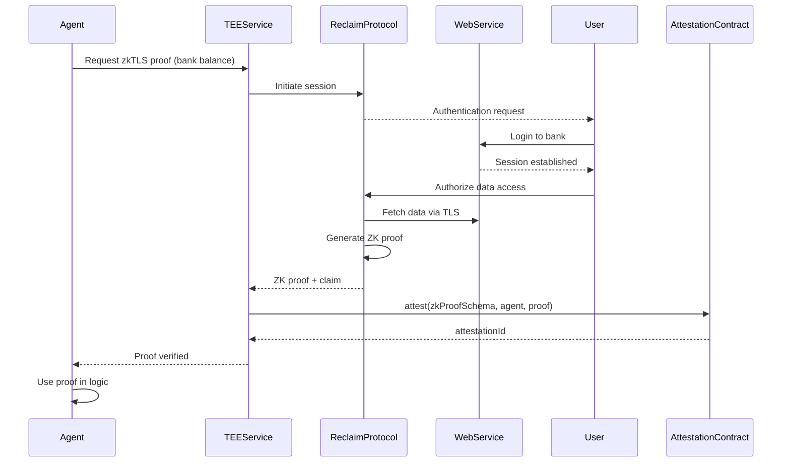

# Design Document: Web3 Infrastructure

## Overview

The Web3 Infrastructure for Kuberna Labs provides a comprehensive blockchain integration layer that enables autonomous AI agents to interact with multiple blockchain networks, execute cross-chain transactions, manage crypto payments, deploy in Trusted Execution Environments (TEEs), and leverage zero-knowledge proofs for privacy-preserving data access. This infrastructure supports the platform's core mission of building revenue-generating autonomous agents operating across decentralized networks with cryptographic guarantees.

The system integrates smart contracts on Ethereum, Polygon, Arbitrum, and NEAR, backend services for payment processing and TEE orchestration, blockchain listeners for event monitoring, and adapters for multi-chain support. It implements the ERC-7683 intent protocol for cross-chain operations, integrates with Phala Network and Marlin Oyster for TEE deployments, and supports zkTLS through Reclaim Protocol and zkPass for privacy-preserving Web2 data access.

## Architecture

### High-Level System Architecture

```mermaid
graph TB
    subgraph "Frontend Layer"
        UI[Web UI]
        SDK[Agent SDK]
    end
    
    subgraph "API Gateway"
        GW[API Gateway]
    end
    
    subgraph "Backend Services"
        PS[Payment Service]
        TS[TEE Service]
        BL[Blockchain Listener]
        ES[Execution Service]
        IS[Intent Service]
    end
    
    subgraph "Smart Contracts"
        subgraph "Ethereum/Polygon/Arbitrum"
            ESC[Escrow Contract]
            INT[Intent Contract]
            CERT[Certificate NFT]
            PAY[Payment Contract]
            REP[Reputation NFT]
            ATT[Attestation Contract]
            CCR[CrossChain Router]
            SUB[Subscription Contract]
        end
        
        subgraph "NEAR Protocol"
            NESC[NEAR Escrow]
            NINT[NEAR Intent]
        end
    end
    
    subgraph "External Services"
        subgraph "TEE Providers"
            PHALA[Phala Network]
            MARLIN[Marlin Oyster]
        end
        
        subgraph "zkTLS"
            RECLAIM[Reclaim Protocol]
            ZKPASS[zkPass]
        end
        
        subgraph "Blockchain Networks"
            ETH[Ethereum]
            POL[Polygon]
            ARB[Arbitrum]
            NEAR[NEAR]
            SOL[Solana]
        end
        
        subgraph "DeFi Protocols"
            UNI[Uniswap]
            AAVE[Aave]
            REF[Ref Finance]
        end
    end
    
    UI --> GW
    SDK --> GW
    GW --> PS
    GW --> TS
    GW --> IS
    GW --> ES
    
    PS --> ESC
    PS --> PAY
    PS --> SUB
    IS --> INT
    IS --> CCR
    TS --> PHALA
    TS --> MARLIN
    TS --> ATT
    ES --> PHALA
    
    BL --> ETH
    BL --> POL
    BL --> ARB
    BL --> NEAR
    BL --> SOL
    
    ESC --> ETH
    INT --> ETH
    CERT --> ETH
    PAY --> POL
    REP --> ETH
    CCR --> ETH
    CCR --> POL
    CCR --> ARB
    
    NESC --> NEAR
    NINT --> NEAR
    
    IS --> UNI
    IS --> AAVE
    IS --> REF
    
    TS --> RECLAIM
    TS --> ZKPASS
```




### Multi-Chain Architecture



### Payment Flow Architecture




### TEE Deployment Workflow



### zkTLS Integration Flow



## Components and Interfaces

### Smart Contract Interfaces

#### Escrow Contract Interface

```solidity
interface IKubernaEscrow {
    enum EscrowStatus { None, Funded, Assigned, Completed, Disputed, Released, Refunded, Expired }
    
    struct EscrowData {
        address requester;
        address executor;
        address token;
        uint256 deadline;
        uint256 amount;
        uint256 fee;
        EscrowStatus status;
        string intentId;
    }
    
    function createEscrow(
        string calldata intentId,
        address token,
        uint256 amount,
        uint256 durationSeconds
    ) external returns (bytes32 escrowId);
    
    function fundEscrow(bytes32 escrowId) external payable;
    
    function assignExecutor(bytes32 escrowId, address executor) external;
    
    function submitCompletion(bytes32 escrowId, bytes32 proofHash) external;
    
    function releaseFunds(bytes32 escrowId) external;
    
    function autoRelease(bytes32 escrowId) external;
    
    function raiseDispute(bytes32 escrowId, string calldata reason) external;
    
    function resolveDispute(bytes32 escrowId, bool refundToRequester) external;
    
    function getEscrow(bytes32 escrowId) external view returns (EscrowData memory);
}
```


#### Intent Contract Interface

```solidity
interface IKubernaIntent {
    enum IntentStatus { Open, Bidding, Assigned, Executing, Completed, Expired, Disputed }
    enum BidStatus { Pending, Accepted, Rejected }
    
    struct IntentData {
        address requester;
        string description;
        bytes structuredData;
        address sourceToken;
        uint256 sourceAmount;
        address destToken;
        uint256 minDestAmount;
        uint256 budget;
        uint256 deadline;
        IntentStatus status;
        address selectedSolver;
        bytes32 escrowId;
    }
    
    struct BidData {
        address solver;
        uint256 price;
        uint256 estimatedTime;
        bytes routeDetails;
        BidStatus status;
        uint256 createdAt;
    }
    
    function createIntent(
        bytes32 intentId,
        string calldata description,
        bytes calldata structuredData,
        address sourceToken,
        uint256 sourceAmount,
        address destToken,
        uint256 minDestAmount,
        uint256 budget,
        uint256 durationSeconds
    ) external returns (bytes32);
    
    function submitBid(
        bytes32 intentId,
        uint256 price,
        uint256 estimatedTime,
        bytes calldata routeDetails
    ) external;
    
    function acceptBid(bytes32 intentId, uint256 solverIndex) external;
    
    function rejectBid(bytes32 intentId, uint256 solverIndex) external;
    
    function retractBid(bytes32 intentId) external;
    
    function cancelIntent(bytes32 intentId) external;
    
    function setEscrow(bytes32 intentId, bytes32 escrowId) external;
    
    function completeIntent(bytes32 intentId) external;
    
    function getIntent(bytes32 intentId) external view returns (IntentData memory);
    
    function getBidCount(bytes32 intentId) external view returns (uint256);
    
    function getBid(bytes32 intentId, uint256 index) external view returns (BidData memory);
}
```

#### Certificate NFT Interface

```solidity
interface IKubernaCertificateNFT {
    struct CertificateData {
        string recipientName;
        string courseTitle;
        string courseId;
        uint256 completionDate;
        string instructorName;
        string verificationHash;
        bool isValid;
    }
    
    function mintCertificate(
        address recipient,
        string calldata recipientName,
        string calldata courseTitle,
        string calldata courseId,
        string calldata instructorName,
        string calldata verificationHash
    ) external returns (uint256 tokenId);
    
    function revokeCertificate(uint256 tokenId, string calldata reason) external;
    
    function verifyCertificate(uint256 tokenId) external view returns (bool);
    
    function getCertificateDetails(uint256 tokenId) external view returns (CertificateData memory);
    
    function getUserCertificates(address user) external view returns (uint256[] memory);
}
```


#### Payment Contract Interface

```solidity
interface IKubernaPayment {
    struct TokenConfig {
        bool enabled;
        uint256 minAmount;
        uint256 maxAmount;
        address oracle;
    }
    
    function addToken(address token, uint256 minAmount, uint256 maxAmount) external;
    
    function removeToken(address token) external;
    
    function processPayment(address token, uint256 amount) external payable;
    
    function batchProcessPayment(
        address[] calldata tokens,
        uint256[] calldata amounts
    ) external payable;
    
    function withdraw(address token, uint256 amount) external;
    
    function withdrawFees(address token, uint256 amount) external;
    
    function getBalance(address user, address token) external view returns (uint256);
    
    function getSupportedTokens() external view returns (address[] memory);
}
```

#### Cross-Chain Router Interface

```solidity
interface ICrossChainRouter {
    enum ChainId {
        ETHEREUM,
        POLYGON,
        ARBITRUM,
        OPTIMISM,
        AVALANCHE,
        BSC,
        NEAR,
        SOLANA
    }
    
    struct CrossChainMessage {
        bytes32 messageId;
        uint256 sourceChainId;
        uint256 destinationChainId;
        address sender;
        address recipient;
        address token;
        uint256 amount;
        bytes data;
        uint256 nonce;
        bool executed;
        uint256 timestamp;
    }
    
    function initiateTransfer(
        uint256 destinationChainId,
        address recipient,
        address token,
        uint256 amount,
        uint256 minReceived
    ) external payable;
    
    function executeTransfer(
        bytes32 messageId,
        address recipient,
        address token,
        uint256 amount,
        uint256 minReceived
    ) external;
    
    function setChainSupport(uint256 chainId, bool supported) external;
    
    function setTokenMapping(
        uint256 chainId,
        address localToken,
        address remoteToken
    ) external;
    
    function getMessage(bytes32 messageId) external view returns (CrossChainMessage memory);
}
```

#### Attestation Contract Interface

```solidity
interface IAttestation {
    struct AttestationData {
        bytes32 schema;
        address recipient;
        address issuer;
        uint64 expirationTime;
        uint64 issuedAt;
        bytes data;
        bool revoked;
    }
    
    function attest(
        bytes32 schema,
        address recipient,
        uint64 expirationTime,
        bytes memory data
    ) external returns (bytes32 attestationId);
    
    function attestBySignature(
        bytes32 schema,
        address recipient,
        uint64 expirationTime,
        bytes memory data,
        bytes calldata signature
    ) external returns (bytes32 attestationId);
    
    function revoke(bytes32 attestationId) external;
    
    function verify(bytes32 attestationId) external view returns (bool);
    
    function getAttestation(bytes32 attestationId) external view returns (AttestationData memory);
}
```


#### Reputation NFT Interface

```solidity
interface IReputationNFT {
    struct AgentReputation {
        uint256 totalTasks;
        uint256 successfulTasks;
        uint256 totalResponseTime;
        uint256 ratingSum;
        uint256 ratingCount;
        uint256 lastUpdated;
    }
    
    struct Badge {
        string name;
        string description;
        uint256 timestamp;
    }
    
    function registerAgent(address agentAddress) external returns (uint256 tokenId);
    
    function updateReputation(
        uint256 tokenId,
        bool success,
        uint256 responseTimeSeconds
    ) external;
    
    function submitRating(uint256 tokenId, uint256 rating) external;
    
    function calculateScore(uint256 tokenId) external view returns (uint256);
    
    function getSuccessRate(uint256 tokenId) external view returns (uint256);
    
    function getBadges(uint256 tokenId) external view returns (Badge[] memory);
    
    function applyDecay(uint256 tokenId) external;
    
    function getStarRating(uint256 tokenId) external view returns (uint256);
}
```

#### Subscription Contract Interface

```solidity
interface IKubernaSubscription {
    enum SubStatus { None, Active, Paused, Cancelled, Expired }
    enum PlanType { Monthly, Annual }
    
    struct Subscription {
        address subscriber;
        uint256 planId;
        uint256 startTime;
        uint256 nextPaymentTime;
        uint256 amountPaid;
        SubStatus status;
    }
    
    struct Plan {
        string name;
        address token;
        uint256 price;
        PlanType planType;
        uint256 durationSeconds;
        bool active;
    }
    
    function createPlan(
        string calldata name,
        address token,
        uint256 price,
        PlanType planType,
        uint256 durationSeconds
    ) external returns (uint256 planId);
    
    function updatePlan(uint256 planId, uint256 newPrice, bool newActive) external;
    
    function subscribe(uint256 planId) external;
    
    function renew(uint256 planId) external;
    
    function cancelSubscription(uint256 planId) external;
    
    function pauseSubscription(uint256 planId) external;
    
    function resumeSubscription(uint256 planId) external;
    
    function getSubscription(address user, uint256 planId) external view returns (Subscription memory);
    
    function getPlan(uint256 planId) external view returns (Plan memory);
    
    function isActive(address user, uint256 planId) external view returns (bool);
}
```


### Backend Service Interfaces

#### Payment Service Interface

```typescript
interface PaymentServiceConfig {
  rpcUrls: {
    ethereum: string;
    polygon: string;
    arbitrum: string;
    near: string;
    solana: string;
  };
  contractAddresses: {
    escrow: Record<string, string>;
    payment: Record<string, string>;
    intent: Record<string, string>;
  };
  stripe: {
    apiKey: string;
    webhookSecret: string;
  };
}

interface CreatePaymentIntentRequest {
  userId: string;
  amount: string;
  currency: string;
  token: string;
  chain: string;
  metadata?: Record<string, any>;
}

interface CreatePaymentIntentResponse {
  intentId: string;
  escrowId: string;
  status: string;
  requiredApproval: {
    token: string;
    spender: string;
    amount: string;
  };
}

interface PaymentService {
  createPaymentIntent(req: CreatePaymentIntentRequest): Promise<CreatePaymentIntentResponse>;
  
  fundEscrow(escrowId: string, txHash: string): Promise<void>;
  
  releasePayment(escrowId: string, proofHash: string): Promise<string>;
  
  refundPayment(escrowId: string, reason: string): Promise<string>;
  
  getPaymentStatus(intentId: string): Promise<PaymentStatus>;
  
  processWithdrawal(userId: string, token: string, amount: string, chain: string): Promise<string>;
  
  estimateGas(chain: string, operation: string, params: any): Promise<GasEstimate>;
  
  getSupportedTokens(chain: string): Promise<TokenInfo[]>;
}

interface PaymentStatus {
  intentId: string;
  escrowId: string;
  status: 'pending' | 'funded' | 'assigned' | 'completed' | 'released' | 'refunded' | 'disputed';
  amount: string;
  token: string;
  chain: string;
  requester: string;
  executor?: string;
  createdAt: Date;
  updatedAt: Date;
}

interface GasEstimate {
  gasLimit: string;
  gasPrice: string;
  totalCost: string;
  totalCostUSD: string;
}

interface TokenInfo {
  address: string;
  symbol: string;
  name: string;
  decimals: number;
  minAmount: string;
  maxAmount: string;
}
```


#### TEE Service Interface

```typescript
interface TEEServiceConfig {
  phala: {
    endpoint: string;
    apiKey: string;
  };
  marlin: {
    endpoint: string;
    apiKey: string;
  };
  attestationContract: {
    address: string;
    chain: string;
  };
}

interface DeployToTEERequest {
  agentId: string;
  code: string;
  config: Record<string, any>;
  provider: 'phala' | 'marlin';
  resources: {
    cpu: number;
    memory: number;
    storage: number;
  };
}

interface DeployToTEEResponse {
  deploymentId: string;
  enclaveId: string;
  endpoint: string;
  attestation: AttestationReport;
  status: 'provisioning' | 'running';
}

interface AttestationReport {
  quote: string;
  mrenclave: string;
  mrsigner: string;
  timestamp: number;
  signature: string;
  isValid: boolean;
}

interface ZKTLSProofRequest {
  agentId: string;
  provider: 'reclaim' | 'zkpass';
  dataSource: string;
  claimType: 'bank_balance' | 'kyc_status' | 'credit_score' | 'twitter_verification';
  parameters: Record<string, any>;
}

interface ZKTLSProofResponse {
  proofId: string;
  claim: any;
  proof: string;
  attestationId: string;
  verified: boolean;
}

interface TEEService {
  deployAgent(req: DeployToTEERequest): Promise<DeployToTEEResponse>;
  
  getDeploymentStatus(deploymentId: string): Promise<TEEDeploymentStatus>;
  
  stopDeployment(deploymentId: string): Promise<void>;
  
  verifyAttestation(attestationReport: AttestationReport): Promise<boolean>;
  
  submitAttestationOnChain(
    deploymentId: string,
    attestation: AttestationReport
  ): Promise<string>;
  
  requestZKTLSProof(req: ZKTLSProofRequest): Promise<ZKTLSProofResponse>;
  
  verifyZKTLSProof(proofId: string): Promise<boolean>;
  
  getEnclaveHealth(enclaveId: string): Promise<EnclaveHealth>;
}

interface TEEDeploymentStatus {
  deploymentId: string;
  enclaveId: string;
  status: 'provisioning' | 'running' | 'stopped' | 'failed';
  endpoint?: string;
  attestationId?: string;
  health: EnclaveHealth;
  createdAt: Date;
  updatedAt: Date;
}

interface EnclaveHealth {
  cpu: number;
  memory: number;
  uptime: number;
  requestCount: number;
  errorRate: number;
  lastPing: Date;
}
```


#### Blockchain Listener Service Interface

```typescript
interface BlockchainListenerConfig {
  chains: {
    ethereum: { rpc: string; wsRpc: string; contracts: string[] };
    polygon: { rpc: string; wsRpc: string; contracts: string[] };
    arbitrum: { rpc: string; wsRpc: string; contracts: string[] };
    near: { rpc: string; wsRpc: string; contracts: string[] };
    solana: { rpc: string; wsRpc: string; contracts: string[] };
  };
  pollInterval: number;
  confirmations: number;
}

interface BlockchainEvent {
  eventName: string;
  contractAddress: string;
  chain: string;
  blockNumber: number;
  transactionHash: string;
  args: Record<string, any>;
  timestamp: Date;
}

interface BlockchainListener {
  start(): Promise<void>;
  
  stop(): Promise<void>;
  
  subscribeToContract(chain: string, address: string, events: string[]): void;
  
  unsubscribeFromContract(chain: string, address: string): void;
  
  onEvent(eventName: string, handler: (event: BlockchainEvent) => Promise<void>): void;
  
  getLatestBlock(chain: string): Promise<number>;
  
  getEventHistory(
    chain: string,
    contract: string,
    eventName: string,
    fromBlock: number,
    toBlock: number
  ): Promise<BlockchainEvent[]>;
}
```

#### Multi-Chain Adapter Interface

```typescript
interface ChainAdapter {
  connect(): Promise<void>;
  
  disconnect(): Promise<void>;
  
  getBalance(address: string, token?: string): Promise<string>;
  
  transfer(to: string, amount: string, token?: string): Promise<string>;
  
  approve(spender: string, amount: string, token: string): Promise<string>;
  
  call(contract: string, method: string, params: any[]): Promise<any>;
  
  estimateGas(contract: string, method: string, params: any[]): Promise<string>;
  
  waitForTransaction(txHash: string, confirmations?: number): Promise<TransactionReceipt>;
  
  getChainId(): Promise<number>;
  
  getCurrentBlock(): Promise<number>;
}

interface EthereumAdapter extends ChainAdapter {
  swapOnUniswap(
    tokenIn: string,
    tokenOut: string,
    amountIn: string,
    minAmountOut: string,
    deadline: number
  ): Promise<string>;
  
  depositToAave(token: string, amount: string): Promise<string>;
  
  borrowFromAave(token: string, amount: string): Promise<string>;
}

interface SolanaAdapter extends ChainAdapter {
  swapOnRaydium(
    tokenIn: string,
    tokenOut: string,
    amountIn: string,
    minAmountOut: string
  ): Promise<string>;
  
  stakeWithMarinade(amount: string): Promise<string>;
}

interface NEARAdapter extends ChainAdapter {
  swapOnRefFinance(
    tokenIn: string,
    tokenOut: string,
    amountIn: string,
    minAmountOut: string
  ): Promise<string>;
  
  depositToBurrow(token: string, amount: string): Promise<string>;
}

interface TransactionReceipt {
  transactionHash: string;
  blockNumber: number;
  status: 'success' | 'failed';
  gasUsed: string;
  logs: any[];
}
```


## Data Models

### Escrow Data Model

```typescript
interface EscrowRecord {
  id: string;
  escrowId: string; // On-chain escrow ID
  intentId: string;
  chain: string;
  contractAddress: string;
  requester: string;
  executor?: string;
  token: string;
  amount: string;
  fee: string;
  status: 'none' | 'funded' | 'assigned' | 'completed' | 'disputed' | 'released' | 'refunded' | 'expired';
  deadline: Date;
  fundingTxHash?: string;
  releaseTxHash?: string;
  proofHash?: string;
  createdAt: Date;
  updatedAt: Date;
}
```

Validation Rules:
- `amount` must be greater than 0
- `deadline` must be in the future when created
- `status` transitions must follow: none → funded → assigned → completed → released
- `executor` required when status is 'assigned' or later
- `proofHash` required when status is 'completed'

### Intent Data Model

```typescript
interface IntentRecord {
  id: string;
  intentId: string; // On-chain intent ID
  requesterId: string;
  description: string;
  structuredData: {
    sourceChain: string;
    sourceToken: string;
    sourceAmount: string;
    destinationChain: string;
    destinationToken: string;
    minDestinationAmount: string;
    route?: string[];
  };
  budget: string;
  currency: string;
  status: 'open' | 'bidding' | 'assigned' | 'executing' | 'completed' | 'expired' | 'disputed';
  selectedSolverId?: string;
  escrowId?: string;
  autoAcceptRules?: {
    lowestPrice?: boolean;
    fastestTime?: boolean;
    minReputation?: number;
  };
  createdAt: Date;
  expiresAt: Date;
  completedAt?: Date;
}
```

Validation Rules:
- `budget` must be greater than 0
- `expiresAt` must be at least 1 hour in the future
- `sourceAmount` must be greater than 0
- `minDestinationAmount` must be greater than 0
- `status` cannot go backwards (e.g., from 'completed' to 'open')

### Bid Data Model

```typescript
interface BidRecord {
  id: string;
  intentId: string;
  agentId: string;
  solverId: string;
  price: string;
  estimatedTime: number; // seconds
  routeDetails: {
    path: string[];
    protocols: string[];
    estimatedGas: string;
    slippage: number;
  };
  status: 'pending' | 'accepted' | 'rejected';
  createdAt: Date;
}
```

Validation Rules:
- `price` must be less than or equal to intent budget
- `estimatedTime` must be less than intent deadline
- `status` can only change from 'pending' to 'accepted' or 'rejected'


### TEE Deployment Data Model

```typescript
interface TEEDeploymentRecord {
  id: string;
  agentId: string;
  provider: 'phala' | 'marlin';
  enclaveId: string;
  attestation: {
    quote: string;
    mrenclave: string;
    mrsigner: string;
    timestamp: number;
    signature: string;
    isValid: boolean;
  };
  attestationId?: string; // On-chain attestation ID
  status: 'provisioning' | 'running' | 'stopped' | 'failed';
  endpoint?: string;
  resources: {
    cpu: number;
    memory: number;
    storage: number;
  };
  cost: {
    hourlyRate: string;
    totalCost: string;
    currency: string;
  };
  createdAt: Date;
  expiresAt?: Date;
  stoppedAt?: Date;
}
```

Validation Rules:
- `provider` must be 'phala' or 'marlin'
- `attestation.isValid` must be true for status 'running'
- `endpoint` required when status is 'running'
- `resources.cpu` must be between 1 and 32
- `resources.memory` must be between 512 and 65536 (MB)

### Certificate Data Model

```typescript
interface CertificateRecord {
  id: string;
  tokenId: number; // NFT token ID
  userId: string;
  courseId: string;
  recipientName: string;
  courseTitle: string;
  instructorName: string;
  completionDate: Date;
  verificationHash: string;
  ipfsHash?: string;
  mintTxHash: string;
  chain: string;
  contractAddress: string;
  isValid: boolean;
  verificationUrl: string;
  qrCode: string; // Base64 encoded QR code
  createdAt: Date;
}
```

Validation Rules:
- `verificationHash` must be unique
- `tokenId` must be unique per contract
- `isValid` defaults to true
- `verificationUrl` format: `https://kuberna.africa/verify/{verificationHash}`

### Attestation Data Model

```typescript
interface AttestationRecord {
  id: string;
  attestationId: string; // On-chain attestation ID
  schema: string;
  recipient: string;
  issuer: string;
  expirationTime?: Date;
  issuedAt: Date;
  data: Record<string, any>;
  revoked: boolean;
  chain: string;
  contractAddress: string;
  txHash: string;
  createdAt: Date;
}
```

Validation Rules:
- `schema` must be a valid schema identifier
- `expirationTime` must be in the future if provided
- `revoked` defaults to false
- `data` must conform to schema structure


## Algorithmic Pseudocode

### Main Payment Processing Algorithm

```typescript
async function processPaymentIntent(request: CreatePaymentIntentRequest): Promise<CreatePaymentIntentResponse> {
  // Preconditions:
  // - request.amount > 0
  // - request.token is supported on request.chain
  // - user has sufficient balance
  
  // Step 1: Validate request
  validatePaymentRequest(request);
  
  // Step 2: Generate unique intent ID
  const intentId = generateIntentId(request.userId, request.chain, Date.now());
  
  // Step 3: Create intent on-chain
  const intentContract = getIntentContract(request.chain);
  const structuredData = encodeIntentData(request);
  const intentTx = await intentContract.createIntent(
    intentId,
    request.metadata?.description || '',
    structuredData,
    request.token,
    request.amount,
    request.token, // destination token (same for simple payment)
    request.amount,
    request.budget || request.amount,
    request.metadata?.durationSeconds || 86400 // 24 hours default
  );
  await intentTx.wait();
  
  // Step 4: Create escrow contract
  const escrowContract = getEscrowContract(request.chain);
  const escrowTx = await escrowContract.createEscrow(
    intentId,
    request.token,
    request.amount,
    request.metadata?.durationSeconds || 86400
  );
  const escrowReceipt = await escrowTx.wait();
  const escrowId = extractEscrowId(escrowReceipt);
  
  // Step 5: Store in database
  await db.intents.create({
    intentId,
    requesterId: request.userId,
    chain: request.chain,
    token: request.token,
    amount: request.amount,
    status: 'open',
    createdAt: new Date(),
    expiresAt: new Date(Date.now() + (request.metadata?.durationSeconds || 86400) * 1000)
  });
  
  await db.escrows.create({
    escrowId,
    intentId,
    chain: request.chain,
    requester: request.userId,
    token: request.token,
    amount: request.amount,
    status: 'none',
    createdAt: new Date()
  });
  
  // Step 6: Return response with approval requirements
  return {
    intentId,
    escrowId,
    status: 'created',
    requiredApproval: {
      token: request.token,
      spender: escrowContract.address,
      amount: request.amount
    }
  };
  
  // Postconditions:
  // - Intent created on-chain
  // - Escrow created on-chain
  // - Records stored in database
  // - User receives approval requirements
}
```

**Preconditions:**
- `request.amount` is a positive number
- `request.token` is in the list of supported tokens for `request.chain`
- User has sufficient balance to cover `request.amount` + gas fees
- `request.chain` is a supported blockchain network

**Postconditions:**
- Intent contract has a new intent with status 'Open'
- Escrow contract has a new escrow with status 'None'
- Database contains intent and escrow records
- Response includes `intentId`, `escrowId`, and approval requirements
- No funds have been transferred yet (awaiting user approval)

**Loop Invariants:** N/A (no loops in this algorithm)


### Escrow Funding Algorithm

```typescript
async function fundEscrow(escrowId: string, txHash: string): Promise<void> {
  // Preconditions:
  // - escrowId exists in database
  // - escrow status is 'none'
  // - txHash is a valid transaction hash
  // - transaction has sufficient confirmations
  
  // Step 1: Retrieve escrow record
  const escrow = await db.escrows.findOne({ escrowId });
  if (!escrow) throw new Error('Escrow not found');
  if (escrow.status !== 'none') throw new Error('Escrow already funded');
  
  // Step 2: Verify transaction on-chain
  const provider = getProvider(escrow.chain);
  const receipt = await provider.waitForTransaction(txHash, REQUIRED_CONFIRMATIONS);
  if (!receipt || receipt.status !== 'success') {
    throw new Error('Transaction failed or not confirmed');
  }
  
  // Step 3: Verify transaction is funding this escrow
  const escrowContract = getEscrowContract(escrow.chain);
  const fundingEvent = receipt.logs.find(log => 
    log.address === escrowContract.address &&
    log.topics[0] === escrowContract.interface.getEventTopic('EscrowFunded')
  );
  
  if (!fundingEvent) throw new Error('No EscrowFunded event found');
  
  const decodedEvent = escrowContract.interface.decodeEventLog(
    'EscrowFunded',
    fundingEvent.data,
    fundingEvent.topics
  );
  
  if (decodedEvent.escrowId !== escrowId) {
    throw new Error('Transaction does not fund this escrow');
  }
  
  // Step 4: Update database
  await db.escrows.update(
    { escrowId },
    {
      status: 'funded',
      fundingTxHash: txHash,
      updatedAt: new Date()
    }
  );
  
  // Step 5: Update intent status
  await db.intents.update(
    { intentId: escrow.intentId },
    {
      status: 'bidding',
      updatedAt: new Date()
    }
  );
  
  // Step 6: Broadcast to solver network
  await nats.publish('intents.new', {
    intentId: escrow.intentId,
    escrowId,
    chain: escrow.chain,
    token: escrow.token,
    amount: escrow.amount,
    deadline: escrow.deadline
  });
  
  // Postconditions:
  // - Escrow status is 'funded'
  // - Intent status is 'bidding'
  // - Solvers notified via NATS
}
```

**Preconditions:**
- Escrow with `escrowId` exists in database
- Escrow status is 'none' (not yet funded)
- `txHash` is a valid transaction hash on the correct chain
- Transaction has at least `REQUIRED_CONFIRMATIONS` confirmations
- Transaction contains an `EscrowFunded` event for this `escrowId`

**Postconditions:**
- Escrow status updated to 'funded' in database
- Intent status updated to 'bidding' in database
- `fundingTxHash` stored in escrow record
- NATS message published to solver network
- Solvers can now submit bids for this intent

**Loop Invariants:** N/A (no loops in this algorithm)


### TEE Deployment Algorithm

```typescript
async function deployAgentToTEE(request: DeployToTEERequest): Promise<DeployToTEEResponse> {
  // Preconditions:
  // - request.agentId exists in database
  // - request.code is valid agent code
  // - request.provider is 'phala' or 'marlin'
  // - user has sufficient credits for deployment
  
  // Step 1: Validate request
  const agent = await db.agents.findOne({ id: request.agentId });
  if (!agent) throw new Error('Agent not found');
  if (agent.status === 'running') throw new Error('Agent already deployed');
  
  // Step 2: Package agent code
  const packagedCode = await packageAgentCode(request.code, request.config);
  
  // Step 3: Select TEE provider
  const teeProvider = request.provider === 'phala' 
    ? new PhalaProvider(config.phala)
    : new MarlinProvider(config.marlin);
  
  // Step 4: Deploy to enclave
  const deployment = await teeProvider.deploy({
    code: packagedCode,
    resources: request.resources,
    timeout: 300000 // 5 minutes
  });
  
  // Step 5: Wait for attestation
  let attestation: AttestationReport;
  let attempts = 0;
  const maxAttempts = 10;
  
  while (attempts < maxAttempts) {
    attestation = await teeProvider.getAttestation(deployment.enclaveId);
    if (attestation.isValid) break;
    await sleep(5000); // Wait 5 seconds
    attempts++;
  }
  
  if (!attestation || !attestation.isValid) {
    await teeProvider.terminate(deployment.enclaveId);
    throw new Error('Failed to obtain valid attestation');
  }
  
  // Step 6: Submit attestation on-chain
  const attestationContract = getAttestationContract('ethereum');
  const schema = keccak256('TEEDeployment');
  const attestationData = encodeAttestationData(attestation);
  
  const attestTx = await attestationContract.attest(
    schema,
    agent.owner,
    Math.floor(Date.now() / 1000) + 31536000, // 1 year expiration
    attestationData
  );
  const attestReceipt = await attestTx.wait();
  const attestationId = extractAttestationId(attestReceipt);
  
  // Step 7: Store deployment record
  const deploymentId = generateDeploymentId();
  await db.teeDeployments.create({
    id: deploymentId,
    agentId: request.agentId,
    provider: request.provider,
    enclaveId: deployment.enclaveId,
    attestation,
    attestationId,
    status: 'running',
    endpoint: deployment.endpoint,
    resources: request.resources,
    createdAt: new Date()
  });
  
  // Step 8: Update agent status
  await db.agents.update(
    { id: request.agentId },
    {
      status: 'running',
      deploymentType: 'tee',
      deploymentUrl: deployment.endpoint,
      teeAttestation: attestation,
      updatedAt: new Date()
    }
  );
  
  // Step 9: Return deployment info
  return {
    deploymentId,
    enclaveId: deployment.enclaveId,
    endpoint: deployment.endpoint,
    attestation,
    status: 'running'
  };
  
  // Postconditions:
  // - Agent deployed in TEE enclave
  // - Valid attestation obtained
  // - Attestation submitted on-chain
  // - Deployment record stored in database
  // - Agent status updated to 'running'
}
```

**Preconditions:**
- Agent with `request.agentId` exists in database
- Agent status is not 'running' (not already deployed)
- `request.code` is valid executable agent code
- `request.provider` is either 'phala' or 'marlin'
- User has sufficient credits/balance for TEE deployment
- `request.resources` are within provider limits

**Postconditions:**
- Agent code deployed inside TEE enclave
- Valid remote attestation obtained from TEE provider
- Attestation verified and submitted to on-chain attestation contract
- TEE deployment record created in database with status 'running'
- Agent record updated with deployment details and status 'running'
- Endpoint URL available for agent communication
- Attestation can be verified by third parties on-chain

**Loop Invariants:**
- During attestation polling loop: `attempts < maxAttempts`
- Each iteration increments `attempts` by 1
- Loop terminates when valid attestation obtained or max attempts reached


### Cross-Chain Intent Execution Algorithm

```typescript
async function executeCrossChainIntent(intentId: string): Promise<string> {
  // Preconditions:
  // - Intent exists and status is 'assigned'
  // - Escrow is funded
  // - Solver is assigned
  // - Source and destination chains are supported
  
  // Step 1: Retrieve intent and escrow
  const intent = await db.intents.findOne({ intentId });
  if (!intent || intent.status !== 'assigned') {
    throw new Error('Intent not ready for execution');
  }
  
  const escrow = await db.escrows.findOne({ intentId });
  if (!escrow || escrow.status !== 'assigned') {
    throw new Error('Escrow not assigned');
  }
  
  // Step 2: Get chain adapters
  const sourceAdapter = getChainAdapter(intent.structuredData.sourceChain);
  const destAdapter = getChainAdapter(intent.structuredData.destinationChain);
  
  // Step 3: Check source balance
  const sourceBalance = await sourceAdapter.getBalance(
    escrow.requester,
    intent.structuredData.sourceToken
  );
  
  if (BigInt(sourceBalance) < BigInt(intent.structuredData.sourceAmount)) {
    throw new Error('Insufficient source balance');
  }
  
  // Step 4: Execute cross-chain transfer
  const crossChainRouter = getCrossChainRouter(intent.structuredData.sourceChain);
  
  // Calculate minimum received with slippage
  const minReceived = await crossChainRouter.getMinReceived(
    intent.structuredData.minDestinationAmount
  );
  
  // Initiate transfer
  const transferTx = await crossChainRouter.initiateTransfer(
    getChainId(intent.structuredData.destinationChain),
    escrow.requester, // recipient
    intent.structuredData.sourceToken,
    intent.structuredData.sourceAmount,
    minReceived
  );
  
  const transferReceipt = await transferTx.wait();
  const messageId = extractMessageId(transferReceipt);
  
  // Step 5: Wait for destination confirmation
  let confirmed = false;
  let attempts = 0;
  const maxAttempts = 60; // 5 minutes with 5-second intervals
  
  while (!confirmed && attempts < maxAttempts) {
    const message = await crossChainRouter.getMessage(messageId);
    if (message.executed) {
      confirmed = true;
      break;
    }
    await sleep(5000);
    attempts++;
  }
  
  if (!confirmed) {
    throw new Error('Cross-chain transfer timeout');
  }
  
  // Step 6: Generate proof of completion
  const proof = {
    messageId,
    sourceChain: intent.structuredData.sourceChain,
    destinationChain: intent.structuredData.destinationChain,
    sourceToken: intent.structuredData.sourceToken,
    destinationToken: intent.structuredData.destinationToken,
    sourceAmount: intent.structuredData.sourceAmount,
    destinationAmount: intent.structuredData.minDestinationAmount,
    sourceTxHash: transferReceipt.transactionHash,
    timestamp: Date.now()
  };
  
  const proofHash = keccak256(JSON.stringify(proof));
  
  // Step 7: Submit completion to escrow
  const escrowContract = getEscrowContract(escrow.chain);
  const completionTx = await escrowContract.submitCompletion(
    escrow.escrowId,
    proofHash
  );
  await completionTx.wait();
  
  // Step 8: Update database
  await db.escrows.update(
    { escrowId: escrow.escrowId },
    {
      status: 'completed',
      proofHash,
      updatedAt: new Date()
    }
  );
  
  await db.intents.update(
    { intentId },
    {
      status: 'completed',
      completedAt: new Date()
    }
  );
  
  // Step 9: Store proof
  await db.proofs.create({
    intentId,
    escrowId: escrow.escrowId,
    proofHash,
    proofData: proof,
    createdAt: new Date()
  });
  
  return proofHash;
  
  // Postconditions:
  // - Cross-chain transfer executed successfully
  // - Proof of completion generated and submitted
  // - Escrow status updated to 'completed'
  // - Intent status updated to 'completed'
  // - Funds ready for release to solver
}
```

**Preconditions:**
- Intent with `intentId` exists and has status 'assigned'
- Escrow for this intent exists and has status 'assigned'
- Solver is assigned to the intent
- Source chain and destination chain are both supported
- Requester has sufficient balance on source chain
- Cross-chain router contract is deployed on source chain

**Postconditions:**
- Cross-chain transfer initiated on source chain
- Transfer confirmed on destination chain
- Proof of completion generated with all transfer details
- Proof hash submitted to escrow contract
- Escrow status updated to 'completed' in database
- Intent status updated to 'completed' in database
- Proof data stored in database for verification
- Funds in escrow ready for release to solver

**Loop Invariants:**
- During confirmation polling loop: `attempts < maxAttempts`
- Each iteration increments `attempts` by 1
- Loop terminates when `message.executed === true` or max attempts reached
- If loop exits without confirmation, error is thrown


### Blockchain Event Listener Algorithm

```typescript
async function startBlockchainListener(): Promise<void> {
  // Preconditions:
  // - RPC and WebSocket endpoints configured for all chains
  // - Contract addresses configured
  // - Database connection established
  
  // Step 1: Initialize providers for each chain
  const providers: Map<string, Provider> = new Map();
  
  for (const [chain, config] of Object.entries(blockchainConfig.chains)) {
    const provider = new ethers.providers.WebSocketProvider(config.wsRpc);
    providers.set(chain, provider);
    
    // Set up reconnection logic
    provider.on('error', async (error) => {
      console.error(`Provider error on ${chain}:`, error);
      await reconnectProvider(chain, provider);
    });
  }
  
  // Step 2: Subscribe to contract events
  for (const [chain, config] of Object.entries(blockchainConfig.chains)) {
    const provider = providers.get(chain);
    
    for (const contractAddress of config.contracts) {
      const contract = getContract(contractAddress, chain, provider);
      
      // Subscribe to all relevant events
      contract.on('EscrowCreated', async (escrowId, requester, token, amount, deadline, event) => {
        await handleEscrowCreated(chain, escrowId, requester, token, amount, deadline, event);
      });
      
      contract.on('EscrowFunded', async (escrowId, funder, amount, event) => {
        await handleEscrowFunded(chain, escrowId, funder, amount, event);
      });
      
      contract.on('EscrowAssigned', async (escrowId, executor, event) => {
        await handleEscrowAssigned(chain, escrowId, executor, event);
      });
      
      contract.on('TaskCompleted', async (escrowId, proofHash, event) => {
        await handleTaskCompleted(chain, escrowId, proofHash, event);
      });
      
      contract.on('FundsReleased', async (escrowId, recipient, amount, event) => {
        await handleFundsReleased(chain, escrowId, recipient, amount, event);
      });
      
      contract.on('IntentCreated', async (intentId, requester, deadline, event) => {
        await handleIntentCreated(chain, intentId, requester, deadline, event);
      });
      
      contract.on('BidSubmitted', async (intentId, solver, price, event) => {
        await handleBidSubmitted(chain, intentId, solver, price, event);
      });
      
      contract.on('BidAccepted', async (intentId, solver, event) => {
        await handleBidAccepted(chain, intentId, solver, event);
      });
      
      contract.on('CertificateMinted', async (tokenId, recipient, courseId, verificationHash, event) => {
        await handleCertificateMinted(chain, tokenId, recipient, courseId, verificationHash, event);
      });
      
      contract.on('AttestationCreated', async (attestationId, schema, recipient, issuer, expirationTime, event) => {
        await handleAttestationCreated(chain, attestationId, schema, recipient, issuer, expirationTime, event);
      });
    }
  }
  
  // Step 3: Set up fallback polling for missed events
  setInterval(async () => {
    for (const [chain, config] of Object.entries(blockchainConfig.chains)) {
      await pollMissedEvents(chain, config.contracts);
    }
  }, blockchainConfig.pollInterval);
  
  // Postconditions:
  // - All providers connected and listening
  // - Event handlers registered for all contracts
  // - Fallback polling active
}

async function handleEscrowFunded(
  chain: string,
  escrowId: string,
  funder: string,
  amount: string,
  event: Event
): Promise<void> {
  // Preconditions:
  // - Event is confirmed (has required confirmations)
  // - Escrow exists in database
  
  // Step 1: Wait for confirmations
  const confirmations = await event.getBlock().then(b => 
    event.provider.getBlockNumber().then(current => current - b.number)
  );
  
  if (confirmations < REQUIRED_CONFIRMATIONS) {
    // Schedule retry
    setTimeout(() => handleEscrowFunded(chain, escrowId, funder, amount, event), 15000);
    return;
  }
  
  // Step 2: Update escrow in database
  const updated = await db.escrows.update(
    { escrowId, chain },
    {
      status: 'funded',
      fundingTxHash: event.transactionHash,
      updatedAt: new Date()
    }
  );
  
  if (!updated) {
    console.error(`Escrow not found: ${escrowId} on ${chain}`);
    return;
  }
  
  // Step 3: Update intent status
  const escrow = await db.escrows.findOne({ escrowId, chain });
  await db.intents.update(
    { intentId: escrow.intentId },
    {
      status: 'bidding',
      updatedAt: new Date()
    }
  );
  
  // Step 4: Notify solver network
  await nats.publish('intents.funded', {
    intentId: escrow.intentId,
    escrowId,
    chain,
    amount,
    timestamp: new Date()
  });
  
  // Step 5: Send notification to requester
  await notificationService.send({
    userId: escrow.requester,
    type: 'success',
    title: 'Escrow Funded',
    body: `Your escrow has been funded. Solvers can now bid on your task.`,
    link: `/marketplace/intents/${escrow.intentId}`
  });
  
  // Postconditions:
  // - Escrow status updated to 'funded'
  // - Intent status updated to 'bidding'
  // - Solver network notified
  // - User notification sent
}
```

**Preconditions:**
- Blockchain RPC and WebSocket endpoints are configured and accessible
- Contract addresses are valid and deployed on respective chains
- Database connection is established and healthy
- NATS messaging system is running and connected

**Postconditions:**
- WebSocket providers connected to all configured chains
- Event listeners registered for all contract events
- Fallback polling mechanism active for missed events
- Event handlers update database and trigger notifications
- System resilient to connection failures with auto-reconnect

**Loop Invariants:**
- For each chain in configuration: provider is connected or reconnecting
- For each contract: all relevant events have registered handlers
- Polling interval maintains consistent event checking


## Key Functions with Formal Specifications

### Function: createEscrow()

```solidity
function createEscrow(
    string calldata intentId,
    address token,
    uint256 amount,
    uint256 durationSeconds
) external returns (bytes32 escrowId)
```

**Preconditions:**
- `intentId` is non-empty string
- `amount > 0`
- `durationSeconds >= MIN_DEADLINE` (300 seconds)
- `durationSeconds <= MAX_DEADLINE` (30 days)
- Escrow with same `intentId` and `msg.sender` does not exist

**Postconditions:**
- New escrow created with unique `escrowId`
- Escrow status is `EscrowStatus.None`
- `escrows[escrowId].requester == msg.sender`
- `escrows[escrowId].amount == amount`
- `escrows[escrowId].fee == (amount * FEE_BASIS_POINTS) / 10000`
- `escrows[escrowId].deadline == block.timestamp + durationSeconds`
- `EscrowCreated` event emitted
- Returns `escrowId`

**Loop Invariants:** N/A

### Function: fundEscrow()

```solidity
function fundEscrow(bytes32 escrowId) external payable nonReentrant
```

**Preconditions:**
- Escrow with `escrowId` exists (`escrows[escrowId].requester != address(0)`)
- Escrow status is `EscrowStatus.None`
- If `token == address(0)`: `msg.value >= amount + fee`
- If `token != address(0)`: `msg.value == 0` AND caller has approved contract for `amount + fee`

**Postconditions:**
- Escrow status updated to `EscrowStatus.Funded`
- If native token: contract balance increased by `amount + fee`
- If ERC20: tokens transferred from caller to contract
- `EscrowFunded` event emitted with `escrowId` and total amount
- No reentrancy possible (nonReentrant modifier)

**Loop Invariants:** N/A

### Function: submitCompletion()

```solidity
function submitCompletion(bytes32 escrowId, bytes32 proofHash) 
    external 
    onlyAssignedExecutor(escrowId) 
    nonReentrant
```

**Preconditions:**
- `msg.sender == escrows[escrowId].executor`
- Escrow status is `EscrowStatus.Assigned`
- `block.timestamp <= escrows[escrowId].deadline`
- `proofHash != bytes32(0)`

**Postconditions:**
- Escrow status updated to `EscrowStatus.Completed`
- `TaskCompleted` event emitted with `escrowId` and `proofHash`
- Executor can now call `autoRelease()` after 24 hours if requester doesn't act
- Requester can call `releaseFunds()` to release payment

**Loop Invariants:** N/A

### Function: releaseFunds()

```solidity
function releaseFunds(bytes32 escrowId) external nonReentrant
```

**Preconditions:**
- `msg.sender == escrows[escrowId].requester`
- Escrow status is `EscrowStatus.Completed`
- `escrows[escrowId].executor != address(0)`

**Postconditions:**
- Escrow status updated to `EscrowStatus.Released`
- `amount` transferred to executor
- `fee` transferred to contract owner
- `FundsReleased` event emitted
- Contract balance decreased by `amount + fee`
- No reentrancy possible

**Loop Invariants:** N/A


### Function: createIntent()

```solidity
function createIntent(
    bytes32 intentId,
    string calldata description,
    bytes calldata structuredData,
    address sourceToken,
    uint256 sourceAmount,
    address destToken,
    uint256 minDestAmount,
    uint256 budget,
    uint256 durationSeconds
) external returns (bytes32)
```

**Preconditions:**
- `budget > 0`
- `durationSeconds >= MIN_DEADLINE` (300 seconds)
- `durationSeconds <= MAX_DEADLINE` (30 days)
- `intents[intentId].requester == address(0)` (intent doesn't exist)
- `sourceAmount > 0`
- `minDestAmount > 0`

**Postconditions:**
- New intent created with `intentId`
- `intents[intentId].requester == msg.sender`
- `intents[intentId].status == IntentStatus.Open`
- `intents[intentId].deadline == block.timestamp + durationSeconds`
- `intentCount` incremented by 1
- `IntentCreated` event emitted
- Returns `intentId`

**Loop Invariants:** N/A

### Function: submitBid()

```solidity
function submitBid(
    bytes32 intentId,
    uint256 price,
    uint256 estimatedTime,
    bytes calldata routeDetails
) external
```

**Preconditions:**
- Intent with `intentId` exists (`intents[intentId].requester != address(0)`)
- `block.timestamp < intents[intentId].deadline`
- Intent status is `IntentStatus.Open` OR `IntentStatus.Bidding`
- `!hasBid[intentId][msg.sender]` (solver hasn't bid yet)
- `price <= intents[intentId].budget`

**Postconditions:**
- New bid added to `bids[intentId]` array
- Bid status is `BidStatus.Pending`
- `hasBid[intentId][msg.sender] == true`
- `solverIntents[msg.sender]` includes `intentId`
- If intent status was `Open`, updated to `Bidding`
- `BidSubmitted` event emitted

**Loop Invariants:** N/A

### Function: acceptBid()

```solidity
function acceptBid(bytes32 intentId, uint256 solverIndex) external
```

**Preconditions:**
- `msg.sender == intents[intentId].requester`
- Intent status is `IntentStatus.Bidding`
- `solverIndex < bids[intentId].length`
- `bids[intentId][solverIndex].status == BidStatus.Pending`

**Postconditions:**
- Selected bid status updated to `BidStatus.Accepted`
- All other pending bids updated to `BidStatus.Rejected`
- `intents[intentId].selectedSolver == bids[intentId][solverIndex].solver`
- Intent status updated to `IntentStatus.Assigned`
- `BidAccepted` event emitted for accepted bid
- `BidRejected` events emitted for all rejected bids
- `IntentAssigned` event emitted

**Loop Invariants:**
- For loop through all bids: All previously processed bids have status `Accepted` or `Rejected`
- Loop index `j` increments from 0 to `bids[intentId].length - 1`
- Only one bid has status `Accepted` after loop completes


### Function: mintCertificate()

```solidity
function mintCertificate(
    address recipient,
    string calldata recipientName,
    string calldata courseTitle,
    string calldata courseId,
    string calldata instructorName,
    string calldata verificationHash
) external onlyMinter returns (uint256 tokenId)
```

**Preconditions:**
- `msg.sender == minter` OR `msg.sender == owner()`
- `recipient != address(0)`
- Certificate with same `recipient`, `courseId`, and `verificationHash` doesn't exist
- `recipientName` is non-empty
- `courseTitle` is non-empty
- `verificationHash` is non-empty

**Postconditions:**
- New NFT minted with `tokenId == _nextTokenId`
- `_nextTokenId` incremented by 1
- `certificateData[tokenId]` populated with all parameters
- `certificateData[tokenId].completionDate == block.timestamp`
- `certificateData[tokenId].isValid == true`
- `certificateHashes[certHash] == true` where `certHash = keccak256(abi.encodePacked(recipient, courseId, verificationHash))`
- `userCertificates[recipient]` includes `tokenId`
- Token URI generated and set
- NFT transferred to `recipient`
- `CertificateMinted` event emitted
- Returns `tokenId`

**Loop Invariants:** N/A

### Function: attest()

```solidity
function attest(
    bytes32 schema,
    address recipient,
    uint64 expirationTime,
    bytes memory data
) external returns (bytes32 attestationId)
```

**Preconditions:**
- `recipient != address(0)`
- If `expirationTime > 0`: `expirationTime > block.timestamp`
- `schema != bytes32(0)`

**Postconditions:**
- New attestation created with unique `attestationId`
- `attestations[attestationId].schema == schema`
- `attestations[attestationId].recipient == recipient`
- `attestations[attestationId].issuer == msg.sender`
- `attestations[attestationId].issuedAt == block.timestamp`
- `attestations[attestationId].revoked == false`
- `issuerAttestations[msg.sender]` includes `attestationId`
- `recipientAttestations[recipient]` includes `attestationId`
- `attestationCount` incremented by 1
- `AttestationCreated` event emitted
- Returns `attestationId`

**Loop Invariants:** N/A

### Function: verify()

```solidity
function verify(bytes32 attestationId) external view returns (bool)
```

**Preconditions:**
- None (view function, no state changes)

**Postconditions:**
- Returns `false` if `attestations[attestationId].issuedAt == 0` (doesn't exist)
- Returns `false` if `attestations[attestationId].revoked == true`
- Returns `false` if `attestations[attestationId].expirationTime > 0` AND `block.timestamp > attestations[attestationId].expirationTime`
- Returns `true` otherwise
- No state changes

**Loop Invariants:** N/A


### Function: initiateTransfer() (Cross-Chain Router)

```solidity
function initiateTransfer(
    uint256 destinationChainId,
    address recipient,
    address token,
    uint256 amount,
    uint256 minReceived
) external payable nonReentrant whenNotPaused
```

**Preconditions:**
- `supportedChains[destinationChainId] == true`
- `recipient != address(0)`
- `amount > 0`
- `msg.value >= bridgeFee`
- If `token != address(0)`: caller has approved contract for `amount`
- `minReceived <= amount` (accounting for slippage)

**Postconditions:**
- Unique `messageId` generated
- If `token == address(0)`: contract balance increased by `amount`
- If `token != address(0)`: tokens transferred from caller to contract
- `messages[messageId]` created with all transfer details
- `messages[messageId].executed == false`
- `nonces[msg.sender]` incremented by 1
- `CrossChainTransferInitiated` event emitted
- No reentrancy possible

**Loop Invariants:** N/A

### Function: updateReputation()

```solidity
function updateReputation(
    uint256 tokenId,
    bool success,
    uint256 responseTimeSeconds
) external onlyOwner
```

**Preconditions:**
- `ownerOf(tokenId) != address(0)` (token exists)
- `msg.sender == owner()`
- `responseTimeSeconds >= 0`

**Postconditions:**
- `agentReputations[tokenId].totalTasks` incremented by 1
- If `success == true`: `agentReputations[tokenId].successfulTasks` incremented by 1
- `agentReputations[tokenId].totalResponseTime` increased by `responseTimeSeconds`
- `agentReputations[tokenId].lastUpdated == block.timestamp`
- Badges checked and awarded if thresholds met
- `ReputationUpdated` event emitted with new score and success rate

**Loop Invariants:** N/A (badge checking uses conditional logic, not loops)

### Function: subscribe()

```solidity
function subscribe(uint256 planId) external nonReentrant
```

**Preconditions:**
- Plan with `planId` exists (`plans[planId].price > 0`)
- `plans[planId].active == true`
- `subscriptions[msg.sender][planId].status == SubStatus.None` (not already subscribed)
- If plan token is ERC20: caller has approved contract for `plans[planId].price`
- If plan token is native: `msg.value >= plans[planId].price`

**Postconditions:**
- Payment processed (tokens transferred to contract)
- New subscription created for `msg.sender` and `planId`
- `subscriptions[msg.sender][planId].status == SubStatus.Active`
- `subscriptions[msg.sender][planId].startTime == block.timestamp`
- `subscriptions[msg.sender][planId].nextPaymentTime == block.timestamp + plans[planId].durationSeconds`
- `subscriberPlans[msg.sender]` includes `planId`
- `SubscriptionCreated` event emitted
- No reentrancy possible

**Loop Invariants:** N/A


## Example Usage

### Example 1: Creating and Funding an Escrow

```typescript
// User creates a payment intent for a task
const paymentService = new PaymentService(config);

const intentRequest = {
  userId: 'user-123',
  amount: '100',
  currency: 'USDC',
  token: '0xA0b86991c6218b36c1d19D4a2e9Eb0cE3606eB48', // USDC on Ethereum
  chain: 'ethereum',
  metadata: {
    description: 'Monitor DeFi protocol TVL',
    durationSeconds: 86400 // 24 hours
  }
};

const intent = await paymentService.createPaymentIntent(intentRequest);
console.log('Intent created:', intent.intentId);
console.log('Escrow created:', intent.escrowId);

// User approves token spending
const usdcContract = new ethers.Contract(intentRequest.token, ERC20_ABI, signer);
const approveTx = await usdcContract.approve(
  intent.requiredApproval.spender,
  intent.requiredApproval.amount
);
await approveTx.wait();

// User funds the escrow
const escrowContract = new ethers.Contract(
  config.contractAddresses.escrow.ethereum,
  ESCROW_ABI,
  signer
);
const fundTx = await escrowContract.fundEscrow(intent.escrowId);
const fundReceipt = await fundTx.wait();

console.log('Escrow funded:', fundReceipt.transactionHash);

// Backend service picks up the event and updates status
// Solvers are notified and can now bid
```

### Example 2: Agent Bidding and Execution

```typescript
// Agent listens for new intents
const natsClient = await connect({ servers: 'nats://localhost:4222' });
const subscription = natsClient.subscribe('intents.funded');

for await (const msg of subscription) {
  const intent = JSON.parse(msg.data);
  
  // Agent evaluates if it can fulfill the intent
  if (canFulfill(intent)) {
    // Submit bid
    const intentContract = new ethers.Contract(
      config.contractAddresses.intent.ethereum,
      INTENT_ABI,
      agentSigner
    );
    
    const bidTx = await intentContract.submitBid(
      intent.intentId,
      ethers.utils.parseUnits('5', 6), // 5 USDC fee
      300, // 5 minutes estimated time
      ethers.utils.defaultAbiCoder.encode(['string[]'], [['direct']])
    );
    await bidTx.wait();
    
    console.log('Bid submitted for intent:', intent.intentId);
  }
}

// After bid is accepted, agent executes the task
async function executeTask(intentId: string) {
  const intent = await db.intents.findOne({ intentId });
  
  // Execute the actual task logic
  const result = await monitorProtocolTVL(intent.metadata);
  
  // Generate proof
  const proof = {
    intentId,
    result,
    timestamp: Date.now(),
    signature: await agentSigner.signMessage(JSON.stringify(result))
  };
  
  const proofHash = ethers.utils.keccak256(
    ethers.utils.toUtf8Bytes(JSON.stringify(proof))
  );
  
  // Submit completion
  const escrowContract = new ethers.Contract(
    config.contractAddresses.escrow.ethereum,
    ESCROW_ABI,
    agentSigner
  );
  
  const completionTx = await escrowContract.submitCompletion(
    intent.escrowId,
    proofHash
  );
  await completionTx.wait();
  
  console.log('Task completed, proof submitted:', proofHash);
}
```


### Example 3: TEE Deployment with Attestation

```typescript
// Deploy agent to TEE
const teeService = new TEEService(config);

const deployRequest = {
  agentId: 'agent-456',
  code: agentCodeBundle,
  config: {
    model: 'gpt-4',
    tools: ['web3', 'defi'],
    secrets: {
      apiKey: 'encrypted-key'
    }
  },
  provider: 'phala',
  resources: {
    cpu: 2,
    memory: 4096,
    storage: 10240
  }
};

const deployment = await teeService.deployAgent(deployRequest);
console.log('Agent deployed to TEE:', deployment.enclaveId);
console.log('Endpoint:', deployment.endpoint);
console.log('Attestation:', deployment.attestation);

// Verify attestation on-chain
const attestationContract = new ethers.Contract(
  config.attestationContract.address,
  ATTESTATION_ABI,
  provider
);

const isValid = await attestationContract.verify(deployment.attestation.attestationId);
console.log('Attestation valid:', isValid);

// Third party can verify the attestation
const attestation = await attestationContract.getAttestation(
  deployment.attestation.attestationId
);
console.log('Attestation details:', attestation);
```

### Example 4: zkTLS Proof Generation

```typescript
// Agent requests zkTLS proof for bank balance
const teeService = new TEEService(config);

const proofRequest = {
  agentId: 'agent-789',
  provider: 'reclaim',
  dataSource: 'bank_of_america',
  claimType: 'bank_balance',
  parameters: {
    minBalance: '10000',
    currency: 'USD'
  }
};

// User receives authentication request
// User logs into bank and authorizes data access

const proof = await teeService.requestZKTLSProof(proofRequest);
console.log('ZK proof generated:', proof.proofId);
console.log('Claim:', proof.claim);
console.log('Verified:', proof.verified);

// Agent can now use the proof in its logic
if (proof.verified && proof.claim.balance >= 10000) {
  // Proceed with high-value transaction
  console.log('User has sufficient balance, proceeding...');
}

// Proof is also submitted on-chain for verification
const attestationContract = new ethers.Contract(
  config.attestationContract.address,
  ATTESTATION_ABI,
  provider
);

const attestation = await attestationContract.getAttestation(proof.attestationId);
console.log('On-chain attestation:', attestation);
```

### Example 5: Cross-Chain Intent Execution

```typescript
// User creates cross-chain swap intent
const intentService = new IntentService(config);

const crossChainIntent = {
  userId: 'user-123',
  description: 'Swap 1 ETH on Ethereum for USDC on Polygon',
  structuredData: {
    sourceChain: 'ethereum',
    sourceToken: '0x0000000000000000000000000000000000000000', // ETH
    sourceAmount: ethers.utils.parseEther('1').toString(),
    destinationChain: 'polygon',
    destinationToken: '0x2791Bca1f2de4661ED88A30C99A7a9449Aa84174', // USDC on Polygon
    minDestinationAmount: ethers.utils.parseUnits('1800', 6).toString() // Min 1800 USDC
  },
  budget: ethers.utils.parseUnits('50', 6).toString(), // 50 USDC max fee
  durationSeconds: 3600 // 1 hour
};

const intent = await intentService.createIntent(crossChainIntent);
console.log('Cross-chain intent created:', intent.intentId);

// Solvers compete to fulfill the intent
// Best solver is selected and executes the swap

// Solver uses cross-chain router
const crossChainRouter = new ethers.Contract(
  config.contractAddresses.crossChainRouter.ethereum,
  CROSS_CHAIN_ROUTER_ABI,
  solverSigner
);

const transferTx = await crossChainRouter.initiateTransfer(
  137, // Polygon chain ID
  intent.requester,
  '0x0000000000000000000000000000000000000000', // ETH
  ethers.utils.parseEther('1'),
  ethers.utils.parseUnits('1800', 6), // Min received
  { value: ethers.utils.parseEther('1').add(bridgeFee) }
);

const receipt = await transferTx.wait();
console.log('Cross-chain transfer initiated:', receipt.transactionHash);

// Wait for confirmation on destination chain
// Submit proof of completion
// Receive payment from escrow
```


### Example 6: Certificate NFT Minting

```typescript
// Backend service mints certificate after course completion
const certificateService = new CertificateService(config);

const certificateData = {
  userId: 'user-123',
  courseId: 'course-456',
  recipientName: 'Alice Johnson',
  courseTitle: 'Agentic Commerce Accelerator',
  instructorName: 'Dr. Smith',
  completionDate: new Date()
};

// Generate verification hash
const verificationHash = ethers.utils.keccak256(
  ethers.utils.toUtf8Bytes(
    `${certificateData.userId}-${certificateData.courseId}-${certificateData.completionDate.getTime()}`
  )
);

// Mint NFT
const certificateContract = new ethers.Contract(
  config.contractAddresses.certificateNFT.ethereum,
  CERTIFICATE_NFT_ABI,
  minterSigner
);

const mintTx = await certificateContract.mintCertificate(
  certificateData.userAddress,
  certificateData.recipientName,
  certificateData.courseTitle,
  certificateData.courseId,
  certificateData.instructorName,
  verificationHash
);

const mintReceipt = await mintTx.wait();
const tokenId = extractTokenId(mintReceipt);

console.log('Certificate NFT minted:', tokenId);

// Generate QR code for verification
const verificationUrl = `https://kuberna.africa/verify/${verificationHash}`;
const qrCode = await QRCode.toDataURL(verificationUrl);

// Store in database
await db.certificates.create({
  tokenId,
  userId: certificateData.userId,
  courseId: certificateData.courseId,
  verificationHash,
  verificationUrl,
  qrCode,
  mintTxHash: mintReceipt.transactionHash,
  chain: 'ethereum',
  isValid: true,
  createdAt: new Date()
});

// Send notification to user
await notificationService.send({
  userId: certificateData.userId,
  type: 'success',
  title: 'Certificate Earned!',
  body: `Congratulations! You've earned a certificate for ${certificateData.courseTitle}`,
  link: `/certificates/${tokenId}`
});
```

## Correctness Properties

### Universal Quantification Statements

1. **Escrow Safety**: ∀ escrowId, if escrow status is 'funded', then contract balance ≥ escrow.amount + escrow.fee

2. **Intent Uniqueness**: ∀ intentId₁, intentId₂, if intentId₁ ≠ intentId₂, then intents[intentId₁] and intents[intentId₂] have different (requester, timestamp) pairs

3. **Bid Acceptance**: ∀ intentId, at most one bid can have status 'accepted' for that intent

4. **Escrow Release**: ∀ escrowId, funds can only be released if status is 'completed' AND (requester approves OR 24 hours passed since completion)

5. **Certificate Uniqueness**: ∀ tokenId₁, tokenId₂, if tokenId₁ ≠ tokenId₂, then certificates[tokenId₁].verificationHash ≠ certificates[tokenId₂].verificationHash

6. **Attestation Validity**: ∀ attestationId, verify(attestationId) returns true IFF (attestation exists AND not revoked AND not expired)

7. **Cross-Chain Message**: ∀ messageId, message can only be executed once (messages[messageId].executed can only transition from false to true)

8. **Reputation Monotonicity**: ∀ tokenId, agentReputations[tokenId].totalTasks is monotonically increasing (never decreases)

9. **Subscription Active**: ∀ (user, planId), isActive(user, planId) returns true IFF (subscription.status == Active AND block.timestamp < subscription.nextPaymentTime + GRACE_PERIOD)

10. **Token Support**: ∀ token, if processPayment(token, amount) succeeds, then tokenConfigs[token].enabled == true

11. **Deadline Enforcement**: ∀ escrowId, if block.timestamp > escrow.deadline AND status is 'none' or 'funded', then requester can call expireAndRefund()

12. **Reentrancy Protection**: ∀ function f with nonReentrant modifier, f cannot be called recursively within the same transaction

13. **Event Emission**: ∀ state-changing function, if execution succeeds, then corresponding event is emitted

14. **Balance Consistency**: ∀ token, sum of all userBalances[user][token] ≤ contract's actual token balance

15. **Bid Ordering**: ∀ intentId, bids are stored in chronological order (bids[intentId][i].createdAt ≤ bids[intentId][i+1].createdAt)


## Error Handling

### Error Scenario 1: Insufficient Funds for Escrow

**Condition**: User attempts to fund escrow but doesn't have enough tokens or ETH

**Response**: 
- Smart contract reverts with "Insufficient ETH sent" or ERC20 transfer fails
- Frontend displays error message with current balance and required amount
- Suggests using fiat on-ramp if balance is too low

**Recovery**: 
- User can acquire more tokens via exchange or on-ramp
- User can reduce task budget and create new intent
- Transaction is not recorded on-chain (reverted)

### Error Scenario 2: Cross-Chain Transfer Timeout

**Condition**: Cross-chain transfer initiated but not confirmed on destination chain within timeout period

**Response**:
- Blockchain listener detects timeout (no execution event after 5 minutes)
- System marks transfer as 'failed' in database
- Funds remain locked in cross-chain router contract

**Recovery**:
- Admin can manually execute transfer on destination chain using message ID
- If transfer cannot be completed, admin can refund source tokens to user
- User notified of failure and refund process
- Incident logged for investigation

### Error Scenario 3: TEE Attestation Failure

**Condition**: TEE deployment succeeds but attestation is invalid or cannot be verified

**Response**:
- Deployment service detects invalid attestation after max retry attempts
- Enclave is immediately terminated
- No attestation submitted on-chain
- Deployment marked as 'failed' in database

**Recovery**:
- User can retry deployment with same or different TEE provider
- If persistent failure, user can deploy to standard cloud environment
- Credits refunded for failed deployment
- Error details logged for debugging

### Error Scenario 4: Blockchain Listener Disconnection

**Condition**: WebSocket connection to blockchain node drops

**Response**:
- Provider emits 'error' event
- Reconnection logic triggered automatically
- Fallback polling mechanism activates to catch missed events

**Recovery**:
- System attempts reconnection with exponential backoff
- While reconnecting, polling checks for missed events every 30 seconds
- Once reconnected, system syncs from last processed block
- Alert sent to admin if reconnection fails after 5 minutes

### Error Scenario 5: Smart Contract Revert

**Condition**: Transaction sent to smart contract reverts due to failed precondition

**Response**:
- Transaction fails on-chain, gas consumed
- Error message extracted from revert reason
- Frontend displays user-friendly error message
- Transaction not recorded in database

**Recovery**:
- User corrects the issue (e.g., approves tokens, waits for deadline)
- User retries transaction
- If persistent, user can contact support with transaction hash


### Error Scenario 6: Dispute Raised

**Condition**: Requester or executor raises dispute on completed task

**Response**:
- Escrow status changed to 'disputed'
- Funds locked in escrow, cannot be released
- Dispute record created with evidence
- Both parties notified

**Recovery**:
- Dispute routed to Kleros arbitration or admin review
- Evidence reviewed by arbitrators
- Decision made: refund to requester OR release to executor
- Losing party may appeal with additional fee
- Final decision executed on-chain

### Error Scenario 7: Gas Price Spike

**Condition**: Gas price increases significantly during transaction submission

**Response**:
- Transaction may fail or be stuck in mempool
- Gas estimation returns much higher cost than expected
- User warned about high gas cost before confirmation

**Recovery**:
- User can wait for gas prices to decrease
- User can increase gas price to speed up transaction
- For urgent transactions, user can use Layer 2 (Polygon, Arbitrum)
- System can batch multiple operations to reduce per-transaction cost

### Error Scenario 8: zkTLS Proof Verification Failure

**Condition**: zkTLS proof generated but fails on-chain verification

**Response**:
- Verification function returns false
- Proof not accepted by agent logic
- User notified of verification failure

**Recovery**:
- User can regenerate proof with correct parameters
- If persistent failure, user can contact zkTLS provider support
- Agent can fall back to alternative verification method
- Incident logged for investigation

### Error Scenario 9: Certificate Revocation

**Condition**: Certificate needs to be revoked due to fraud or error

**Response**:
- Admin calls revokeCertificate() on contract
- Certificate marked as invalid on-chain
- Database updated with revocation status
- User notified of revocation

**Recovery**:
- If revoked in error, admin can mint new certificate
- User can appeal revocation with evidence
- Revocation is permanent on-chain but new certificate can be issued
- Verification URL shows revocation status

### Error Scenario 10: Subscription Payment Failure

**Condition**: Automatic subscription renewal fails due to insufficient balance

**Response**:
- Renewal transaction reverts
- Subscription enters grace period (24 hours)
- User notified of payment failure

**Recovery**:
- User can manually renew within grace period
- User can add funds and retry
- After grace period, subscription marked as 'expired'
- User must re-subscribe to regain access


## Testing Strategy

### Unit Testing Approach

**Smart Contracts (Hardhat + Chai)**:
- Test each function in isolation with various inputs
- Test precondition violations (expect reverts)
- Test state transitions (status changes)
- Test event emissions
- Test access control (onlyOwner, onlyMinter)
- Test edge cases (zero amounts, max values, boundary conditions)
- Coverage target: 100% for critical contracts (Escrow, Intent, Payment)

**Example Test Cases**:
```typescript
describe('KubernaEscrow', () => {
  it('should create escrow with valid parameters', async () => {
    const tx = await escrow.createEscrow('intent-1', token.address, 100, 86400);
    const receipt = await tx.wait();
    const escrowId = receipt.events[0].args.escrowId;
    
    const escrowData = await escrow.getEscrow(escrowId);
    expect(escrowData.requester).to.equal(requester.address);
    expect(escrowData.amount).to.equal(100);
  });
  
  it('should revert when funding with insufficient ETH', async () => {
    const escrowId = await createTestEscrow();
    await expect(
      escrow.fundEscrow(escrowId, { value: 50 })
    ).to.be.revertedWith('Insufficient ETH sent');
  });
  
  it('should emit EscrowFunded event', async () => {
    const escrowId = await createTestEscrow();
    await expect(escrow.fundEscrow(escrowId, { value: 100 }))
      .to.emit(escrow, 'EscrowFunded')
      .withArgs(escrowId, requester.address, 100);
  });
});
```

**Backend Services (Jest + Supertest)**:
- Test API endpoints with various payloads
- Test database operations (CRUD)
- Test external service integrations (mocked)
- Test error handling and edge cases
- Test authentication and authorization
- Coverage target: 90% for service layer

**Example Test Cases**:
```typescript
describe('PaymentService', () => {
  it('should create payment intent', async () => {
    const request = {
      userId: 'user-123',
      amount: '100',
      currency: 'USDC',
      token: USDC_ADDRESS,
      chain: 'ethereum'
    };
    
    const result = await paymentService.createPaymentIntent(request);
    
    expect(result.intentId).toBeDefined();
    expect(result.escrowId).toBeDefined();
    expect(result.status).toBe('created');
  });
  
  it('should throw error for unsupported token', async () => {
    const request = {
      userId: 'user-123',
      amount: '100',
      currency: 'INVALID',
      token: '0x0000000000000000000000000000000000000000',
      chain: 'ethereum'
    };
    
    await expect(
      paymentService.createPaymentIntent(request)
    ).rejects.toThrow('Token not supported');
  });
});
```


### Property-Based Testing Approach

**Property Test Library**: fast-check (for TypeScript/JavaScript)

**Smart Contract Properties**:

1. **Escrow Balance Invariant**: For any sequence of escrow operations, the contract balance should always equal the sum of all active escrow amounts plus fees.

```typescript
fc.assert(
  fc.property(
    fc.array(fc.record({
      operation: fc.constantFrom('create', 'fund', 'release', 'refund'),
      amount: fc.integer({ min: 1, max: 1000 }),
      token: fc.constantFrom(ETH_ADDRESS, USDC_ADDRESS)
    })),
    async (operations) => {
      // Execute operations
      let expectedBalance = 0;
      for (const op of operations) {
        if (op.operation === 'fund') expectedBalance += op.amount;
        if (op.operation === 'release' || op.operation === 'refund') {
          expectedBalance -= op.amount;
        }
      }
      
      // Check contract balance matches expected
      const actualBalance = await getContractBalance();
      expect(actualBalance).toBe(expectedBalance);
    }
  )
);
```

2. **Intent Status Progression**: Intent status can only progress forward (open → bidding → assigned → executing → completed), never backward.

```typescript
fc.assert(
  fc.property(
    fc.array(fc.constantFrom('open', 'bidding', 'assigned', 'executing', 'completed')),
    async (statusSequence) => {
      const intent = await createTestIntent();
      
      for (let i = 1; i < statusSequence.length; i++) {
        const prevStatus = statusSequence[i - 1];
        const nextStatus = statusSequence[i];
        
        // Status should only move forward
        const prevIndex = STATUS_ORDER.indexOf(prevStatus);
        const nextIndex = STATUS_ORDER.indexOf(nextStatus);
        expect(nextIndex).toBeGreaterThanOrEqual(prevIndex);
      }
    }
  )
);
```

3. **Bid Acceptance Uniqueness**: For any intent, only one bid can be accepted regardless of the number of bids submitted.

```typescript
fc.assert(
  fc.property(
    fc.integer({ min: 1, max: 20 }), // number of bids
    async (numBids) => {
      const intent = await createTestIntent();
      
      // Submit multiple bids
      for (let i = 0; i < numBids; i++) {
        await submitBid(intent.intentId, `solver-${i}`, 100 + i);
      }
      
      // Accept one bid
      await acceptBid(intent.intentId, 0);
      
      // Count accepted bids
      const bids = await getBids(intent.intentId);
      const acceptedCount = bids.filter(b => b.status === 'accepted').length;
      
      expect(acceptedCount).toBe(1);
    }
  )
);
```

4. **Certificate Verification Hash Uniqueness**: No two certificates can have the same verification hash.

```typescript
fc.assert(
  fc.property(
    fc.array(fc.record({
      recipient: fc.hexaString({ minLength: 40, maxLength: 40 }),
      courseId: fc.string(),
      timestamp: fc.integer({ min: 0, max: Date.now() })
    }), { minLength: 2, maxLength: 100 }),
    async (certificates) => {
      const hashes = new Set();
      
      for (const cert of certificates) {
        const hash = generateVerificationHash(cert);
        expect(hashes.has(hash)).toBe(false);
        hashes.add(hash);
      }
    }
  )
);
```

5. **Reputation Score Bounds**: Reputation score is always between 0 and 1000 regardless of task history.

```typescript
fc.assert(
  fc.property(
    fc.array(fc.record({
      success: fc.boolean(),
      responseTime: fc.integer({ min: 1, max: 3600 }),
      rating: fc.integer({ min: 1, max: 5 })
    }), { minLength: 1, maxLength: 1000 }),
    async (taskHistory) => {
      const tokenId = await registerAgent();
      
      for (const task of taskHistory) {
        await updateReputation(tokenId, task.success, task.responseTime);
        if (task.rating) await submitRating(tokenId, task.rating);
      }
      
      const score = await calculateScore(tokenId);
      expect(score).toBeGreaterThanOrEqual(0);
      expect(score).toBeLessThanOrEqual(1000);
    }
  )
);
```


### Integration Testing Approach

**End-to-End Workflow Tests**:

1. **Complete Payment Flow**: Test entire flow from intent creation to fund release
   - Create intent
   - Fund escrow
   - Submit bids
   - Accept bid
   - Execute task
   - Submit completion
   - Release funds
   - Verify all state transitions and events

2. **Cross-Chain Transfer**: Test complete cross-chain swap
   - Create cross-chain intent
   - Fund escrow on source chain
   - Initiate transfer via router
   - Wait for destination confirmation
   - Submit proof
   - Release payment

3. **TEE Deployment Lifecycle**: Test full TEE deployment and attestation
   - Deploy agent to TEE
   - Obtain attestation
   - Submit attestation on-chain
   - Verify attestation
   - Execute agent tasks
   - Stop deployment

4. **Certificate Issuance**: Test certificate minting and verification
   - Complete course
   - Mint certificate NFT
   - Generate QR code
   - Verify certificate on-chain
   - Test revocation

**Test Environment**:
- Local blockchain (Hardhat Network)
- Mock TEE providers
- Mock zkTLS services
- Test database (PostgreSQL)
- Test NATS server

**Integration Test Example**:
```typescript
describe('Complete Payment Flow', () => {
  it('should execute full payment workflow', async () => {
    // 1. Create intent
    const intent = await paymentService.createPaymentIntent({
      userId: 'user-123',
      amount: '100',
      currency: 'USDC',
      token: USDC_ADDRESS,
      chain: 'ethereum'
    });
    
    // 2. Fund escrow
    await usdcContract.approve(escrowContract.address, 100);
    await escrowContract.fundEscrow(intent.escrowId);
    
    // Wait for blockchain listener to process event
    await waitForStatus(intent.escrowId, 'funded');
    
    // 3. Agent submits bid
    await intentContract.connect(agent).submitBid(
      intent.intentId,
      5, // 5 USDC fee
      300, // 5 minutes
      '0x'
    );
    
    // 4. Requester accepts bid
    await intentContract.connect(requester).acceptBid(intent.intentId, 0);
    
    // 5. Agent executes task and submits completion
    const proofHash = ethers.utils.keccak256(ethers.utils.toUtf8Bytes('proof'));
    await escrowContract.connect(agent).submitCompletion(intent.escrowId, proofHash);
    
    // 6. Requester releases funds
    await escrowContract.connect(requester).releaseFunds(intent.escrowId);
    
    // 7. Verify final state
    const escrow = await escrowContract.getEscrow(intent.escrowId);
    expect(escrow.status).toBe(EscrowStatus.Released);
    
    const agentBalance = await usdcContract.balanceOf(agent.address);
    expect(agentBalance).toBe(100); // Received payment
  });
});
```


## Performance Considerations

### Gas Optimization

**Smart Contract Optimizations**:
1. Use `uint256` instead of smaller types (no gas savings with smaller types in storage)
2. Pack struct fields to minimize storage slots
3. Use `unchecked` blocks for arithmetic that cannot overflow
4. Cache storage variables in memory when used multiple times
5. Use events instead of storage for historical data
6. Batch operations where possible (e.g., `batchProcessPayment`)
7. Use `immutable` for constants set in constructor
8. Minimize external calls and use `staticcall` for view functions

**Gas Cost Estimates**:
- Create escrow: ~150,000 gas (~$3-10 depending on gas price)
- Fund escrow: ~80,000 gas (~$2-5)
- Submit bid: ~100,000 gas (~$2-7)
- Accept bid: ~120,000 gas (~$3-8)
- Release funds: ~90,000 gas (~$2-6)
- Mint certificate: ~200,000 gas (~$5-15)
- Create attestation: ~150,000 gas (~$3-10)

**Layer 2 Strategy**:
- Deploy contracts on Polygon and Arbitrum for lower gas costs
- Use Polygon for high-frequency operations (bidding, reputation updates)
- Use Ethereum mainnet for high-value escrows and certificates
- Estimated gas savings: 90-95% on Layer 2

### API Performance

**Target Latencies**:
- Payment intent creation: < 500ms
- Escrow status check: < 100ms
- Intent listing: < 200ms (with pagination)
- TEE deployment: < 30 seconds
- zkTLS proof generation: < 60 seconds
- Certificate minting: < 10 seconds

**Optimization Strategies**:
1. Database indexing on frequently queried fields (intentId, escrowId, userId, status)
2. Redis caching for frequently accessed data (token prices, gas estimates, supported tokens)
3. Connection pooling for database and blockchain providers
4. Batch blockchain queries using multicall
5. Async processing for non-critical operations (notifications, analytics)
6. CDN for static assets (certificate images, QR codes)

### Blockchain Listener Performance

**Event Processing**:
- WebSocket connections for real-time events
- Fallback polling every 30 seconds for missed events
- Batch processing of multiple events in single database transaction
- Parallel processing of events from different chains
- Event deduplication to prevent double-processing

**Scalability**:
- Horizontal scaling: Multiple listener instances with event deduplication
- Vertical scaling: Increase polling frequency and batch size
- Target: Process 1000 events/minute across all chains

### Database Performance

**Optimization Strategies**:
1. Composite indexes on (intentId, status), (escrowId, chain), (userId, createdAt)
2. Partitioning large tables by date (audit_logs, blockchain_events)
3. Read replicas for analytics and reporting queries
4. Write-ahead logging for high-throughput writes
5. Vacuum and analyze regularly to maintain query performance

**Expected Load**:
- 10,000 intents/day
- 50,000 bids/day
- 100,000 blockchain events/day
- 1,000 TEE deployments/day
- 5,000 certificate mints/day


## Security Considerations

### Smart Contract Security

**Vulnerabilities Addressed**:

1. **Reentrancy**: All state-changing functions use `nonReentrant` modifier from OpenZeppelin
   - Funds transferred after state updates
   - External calls made last in function execution

2. **Integer Overflow/Underflow**: Solidity 0.8.x has built-in overflow checks
   - Use `unchecked` only where overflow is impossible
   - Validate all arithmetic operations

3. **Access Control**: Role-based access control using OpenZeppelin Ownable
   - `onlyOwner` for admin functions
   - `onlyMinter` for certificate minting
   - `onlyAssignedExecutor` for task completion

4. **Front-Running**: Mitigated through:
   - Commit-reveal schemes for sensitive operations
   - Slippage protection for cross-chain transfers
   - Deadline parameters for time-sensitive operations

5. **Denial of Service**: Protected against:
   - Gas limit attacks (no unbounded loops)
   - Block gas limit (batch operations have size limits)
   - Withdrawal pattern (users pull funds, not pushed)

6. **Oracle Manipulation**: Price oracles use:
   - Chainlink price feeds (decentralized)
   - Time-weighted average prices (TWAP)
   - Multiple oracle sources with median calculation

**Audit Requirements**:
- Smart contracts must be audited by reputable firm (Trail of Bits, OpenZeppelin, Consensys Diligence)
- Audit report published publicly
- Bug bounty program for responsible disclosure
- Minimum 2-week timelock for contract upgrades

### Backend Security

**Authentication & Authorization**:
1. JWT tokens with short expiration (15 minutes)
2. Refresh tokens stored in httpOnly cookies
3. Role-based access control (RBAC) for admin functions
4. API rate limiting (100 requests/minute per user)
5. IP whitelisting for admin endpoints

**Data Protection**:
1. Encryption at rest (AES-256) for sensitive data
2. Encryption in transit (TLS 1.3)
3. Private keys stored in hardware security modules (HSM) or AWS KMS
4. Secrets managed via environment variables or secret manager
5. Database credentials rotated regularly

**API Security**:
1. Input validation and sanitization
2. SQL injection prevention (parameterized queries)
3. XSS prevention (output encoding)
4. CSRF protection (CSRF tokens)
5. CORS configuration (whitelist allowed origins)

### TEE Security

**Attestation Verification**:
1. Remote attestation verified on-chain
2. MRENCLAVE hash checked against expected value
3. Signature verification using TEE provider's public key
4. Attestation expiration enforced (max 1 year)

**Key Management**:
1. Keys generated inside enclave, never exposed
2. Sealed storage for persistent keys
3. Key rotation every 90 days
4. Multi-party computation for critical operations

**Code Integrity**:
1. Agent code signed before deployment
2. Signature verified inside enclave
3. Code hash recorded on-chain
4. Immutable code execution (no runtime modifications)

### zkTLS Security

**Privacy Guarantees**:
1. Zero-knowledge proofs reveal only required data
2. User credentials never exposed to agent or platform
3. TLS session keys ephemeral (not stored)
4. Proof verification on-chain (trustless)

**Proof Integrity**:
1. Cryptographic binding between proof and claim
2. Timestamp included in proof (prevents replay)
3. Nonce prevents proof reuse
4. Proof expiration enforced (max 24 hours)

### Incident Response

**Monitoring & Alerts**:
1. Real-time monitoring of contract events
2. Anomaly detection (unusual transaction patterns)
3. Alert on large withdrawals or fund movements
4. Dashboard for security metrics

**Emergency Procedures**:
1. Pause functionality in contracts (emergency stop)
2. Multi-sig for critical operations (3-of-5)
3. Incident response team on-call 24/7
4. Communication plan for users and stakeholders

**Post-Incident**:
1. Root cause analysis
2. Patch deployment
3. User notification and compensation if needed
4. Public post-mortem report


## Dependencies

### Smart Contract Dependencies

**OpenZeppelin Contracts** (v5.0.0):
- `@openzeppelin/contracts/token/ERC20/IERC20.sol` - ERC20 token interface
- `@openzeppelin/contracts/token/ERC20/utils/SafeERC20.sol` - Safe ERC20 operations
- `@openzeppelin/contracts/token/ERC721/ERC721.sol` - NFT base contract
- `@openzeppelin/contracts/token/ERC721/extensions/ERC721URIStorage.sol` - NFT metadata
- `@openzeppelin/contracts/access/Ownable.sol` - Access control
- `@openzeppelin/contracts/utils/ReentrancyGuard.sol` - Reentrancy protection
- `@openzeppelin/contracts/utils/Pausable.sol` - Emergency pause
- `@openzeppelin/contracts/utils/cryptography/ECDSA.sol` - Signature verification
- `@openzeppelin/contracts/utils/cryptography/EIP712.sol` - Typed signatures

**Chainlink** (v0.8.0):
- `@chainlink/contracts/src/v0.8/interfaces/AggregatorV3Interface.sol` - Price feeds

### Backend Dependencies

**Node.js Packages**:
- `ethers` (v6.x) - Ethereum library
- `@solana/web3.js` (v1.x) - Solana library
- `near-api-js` (v2.x) - NEAR library
- `express` (v4.x) - Web framework
- `pg` (v8.x) - PostgreSQL client
- `redis` (v4.x) - Redis client
- `nats` (v2.x) - NATS messaging
- `stripe` (v12.x) - Payment processing
- `@phala/sdk` (v0.x) - Phala Network SDK
- `axios` (v1.x) - HTTP client
- `ws` (v8.x) - WebSocket client
- `qrcode` (v1.x) - QR code generation
- `jsonwebtoken` (v9.x) - JWT authentication
- `bcrypt` (v5.x) - Password hashing
- `joi` (v17.x) - Input validation
- `winston` (v3.x) - Logging

**Development Dependencies**:
- `hardhat` (v2.x) - Smart contract development
- `@nomicfoundation/hardhat-toolbox` - Hardhat plugins
- `jest` (v29.x) - Testing framework
- `supertest` (v6.x) - API testing
- `fast-check` (v3.x) - Property-based testing
- `typescript` (v5.x) - Type safety
- `eslint` (v8.x) - Linting
- `prettier` (v3.x) - Code formatting

### External Services

**Blockchain Networks**:
- Ethereum (Mainnet, Sepolia testnet)
- Polygon (Mainnet, Mumbai testnet)
- Arbitrum (Mainnet, Sepolia testnet)
- NEAR Protocol (Mainnet, Testnet)
- Solana (Mainnet, Devnet)

**RPC Providers**:
- Alchemy (primary)
- Infura (backup)
- QuickNode (backup)

**TEE Providers**:
- Phala Network
- Marlin Oyster

**zkTLS Providers**:
- Reclaim Protocol
- zkPass

**Payment Providers**:
- Stripe (fiat on-ramp)
- MoonPay (crypto on-ramp)
- Transak (crypto on-ramp)

**Infrastructure**:
- AWS (hosting, storage, KMS)
- PostgreSQL (database)
- Redis (caching)
- NATS (messaging)
- Docker (containerization)
- Kubernetes (orchestration)

**Monitoring & Analytics**:
- Datadog (monitoring)
- Sentry (error tracking)
- Mixpanel (analytics)

