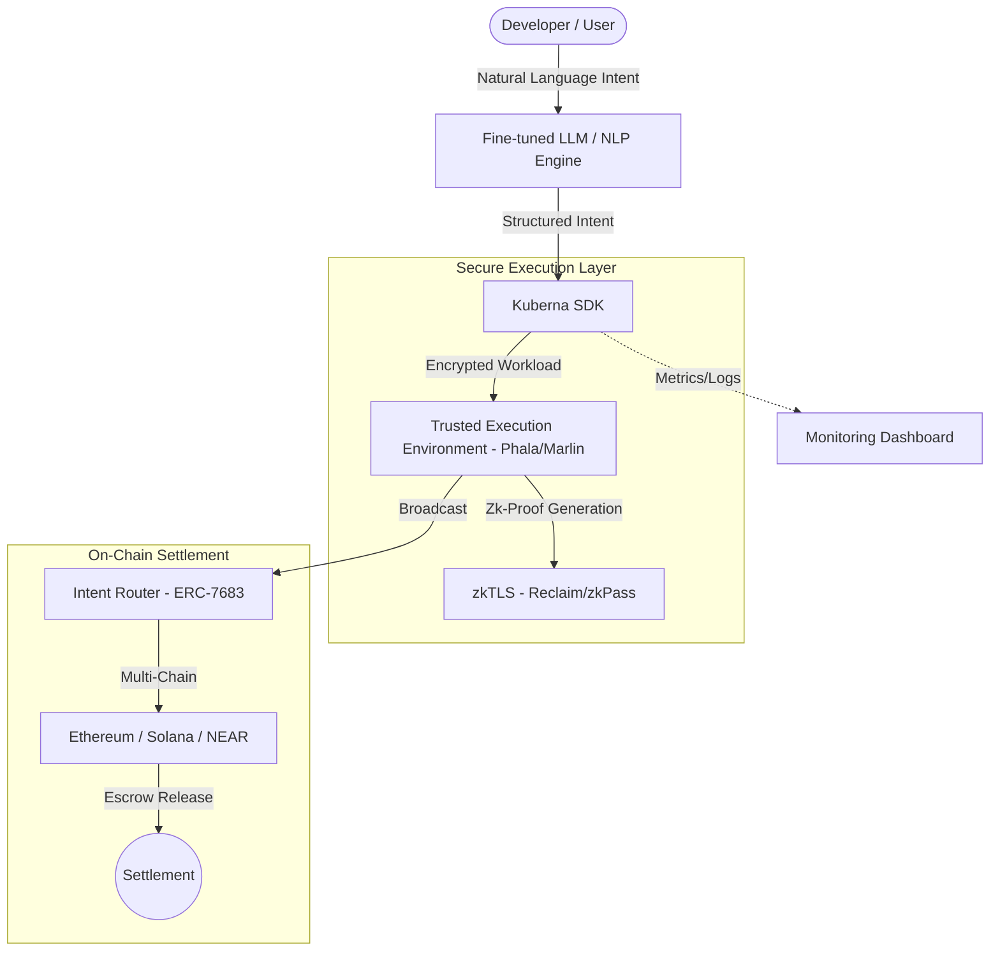

<div align="center">
  
  <h1>Kuberna Labs</h1>
  <p><strong>Architecting the Agentic Web3 Enterprise</strong></p>

  [](https://github.com/kuberna-labs)
  [](/LICENSE)
  [](https://discord.gg/kuberna)
  [](https://twitter.com/Arnaud_Kennedy)
</div>

---

### 🎥 Terminal Execution Demo
<!-- [PLACEHOLDER: Insert vhs-terminal-demo.gif here] -->


---

## ⚡ The Hook: Web3 Agents, Simplified.

Stop fighting with brittle API wrappers and complex wallet integrations. Kuberna abstracts the complexity of cross-chain finance and secure execution into a unified SDK.

### **Before: Manual Chaos**
```typescript
// Traditional approach: Manual gas estimation, wallet management, and cross-chain routing
const provider = new ethers.JsonRpcProvider(RPC_URL);
const wallet = new ethers.Wallet(PRIVATE_KEY, provider);
const tx = await bridgeContract.swapAndBridge(
  sourceToken, 
  targetChain, 
  amount, 
  { gasLimit: 500000 }
);
// ... plus 50 more lines for error handling, retries, and intent fulfillment
```

### **After: Kuberna Elegance**
```typescript
import { KubernaSDK } from '@kuberna/sdk';

const agent = await KubernaSDK.initialize({ wallet: process.env.WALLET_KEY });
await agent.deploy({
  task: "Swap 1 ETH to SOL and stake on Marinade",
  secureExecution: "TEE"
});
```

---

## 🛠 Architecture

Kuberna Labs orchestrates a seamless flow from high-level LLM commands to verified on-chain state changes, all protected by Trusted Execution Environments.



---

## 🚀 2-Minute Quickstart

Get your first agent running in seconds.

### 1. Install the SDK
```bash
npm install @kuberna/sdk
```

### 2. Initialize and Deploy
Create an `index.ts` file:
```typescript
import { KubernaSDK } from '@kuberna/sdk';

async function main() {
  const sdk = new KubernaSDK({ apiKey: 'YOUR_API_KEY' });
  const agent = await sdk.createAgent({
    name: "YieldOptimizer",
    framework: "ElizaOS"
  });

  console.log(`Agent ${agent.id} is live!`);
}

main();
```

### 3. Run
```bash
npx ts-node index.ts
```

---

## 🌟 Core Features

- **Multi-Chain Intents (ERC-7683)**: Deploy agents that operate across Ethereum, Solana, NEAR, and more without managing bridges manually.
- **Trusted Execution (TEE)**: Run your proprietary AI logic in Phala Network enclaves with cryptographic proof of execution.
- **zkTLS Data Privacy**: Fetch verified Web2 data (Bank balances, KYC) using Reclaim Protocol without revealing private credentials.
- **Agentic IDE**: A browser-based environment for writing, debugging, and deploying agents with built-in AI assistance.
- **Intent Marketplace**: A decentralized solver network where agents compete to fulfill tasks with optimized pricing.

---

## 🏗 Project Structure

```bash
kuberna-labs/
├── contracts/          # Solidity smart contracts (Hardhat)
│   ├── Escrow.sol      # Secure fund management
│   ├── Intent.sol      # Cross-chain intent protocol
│   └── Reputation.sol  # On-chain agent trust scores
├── backend/            # Node.js Agentic Gateway & API
├── frontend/           # React-based Agent Dashboard
└── sdk/                # @kuberna/sdk source
```

---

## 🛡 Security & Trust

Kuberna is built on a foundation of cryptographic guarantees:
- **Non-Custodial**: You always control your keys.
- **Verifiable**: TEE attestations are checked on-chain.
- **Audited**: Core contracts are derived from OpenZeppelin v5 standards.

---

## 🤝 Contributing

We're building the future of the agentic economy. See [CONTRIBUTING.md](./CONTRIBUTING.md) to get started.

---

<div align="center">
  Built with ❤️ in <b>Kigali, Rwanda</b> by the Kuberna Labs Team.
</div>